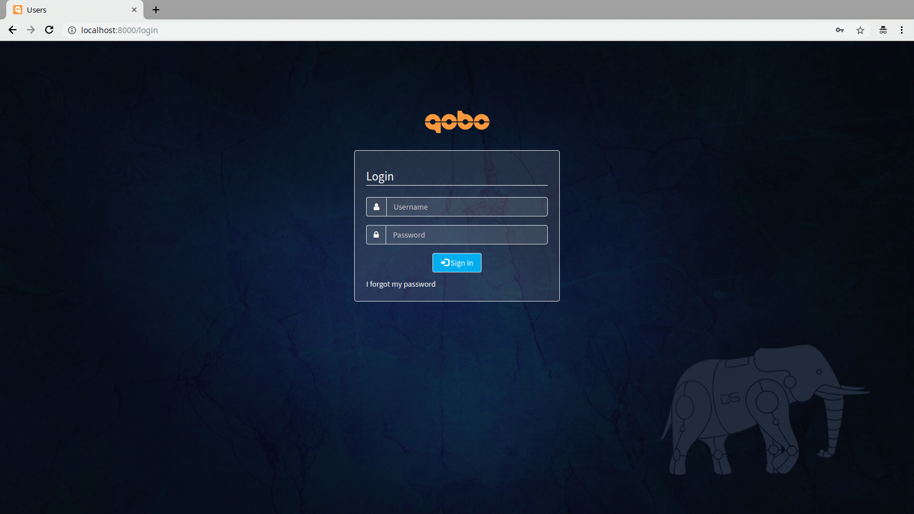

project-template-cakephp
========================

[](https://travis-ci.org/QoboLtd/project-template-cakephp)
[](https://packagist.org/packages/qobo/project-template-cakephp)
[](https://packagist.org/packages/qobo/project-template-cakephp)
[](https://packagist.org/packages/qobo/project-template-cakephp)
[](https://packagist.org/packages/qobo/project-template-cakephp)
[](https://codecov.io/gh/QoboLtd/project-template-cakephp)
[](https://bettercodehub.com/)

About
-----

This is a template for the new CakePHP projects.

Developed by [Qobo](https://www.qobo.biz), used in [Qobrix](https://qobrix.com).

Install
-------

There are two ways to install and start using this project template.

### Composer

You can create a new project from this template using composer.

```bash
composer create-project qobo/project-template-cakephp example.com
cd example.com
./bin/build app:install DB_NAME="app",CHOWN_USER=$USER,CHGRP_GROUP=$USER,PROJECT_NAME="My Project",PROJECT_VERSION="v1.0.0"
```

Note that the `CHOWN_USER` and `CHGRP_GROUP` above should be set to the user and group
that is used by the web server.  In case of Apache and Nginx, these can be `nobody`
or `nginx` or `apache`.  For the local development environment (regular user, without
root access) should be set to the current user and group.

### Git

Alternatively, if you want to be able to update your project to the latest version
of the template, you can install the template with git.

```bash
mkdir example.com
cd example.com
git init
# Pull the latest version from https://github.com/QoboLtd/project-template-cakephp/releases
git pull git@github.com:QoboLtd/project-template-cakephp.git vX.Y.Z
composer update
./bin/build app:install DB_NAME="app",CHOWN_USER=$USER,CHGRP_GROUP=$USER,PROJECT_NAME="My Project",PROJECT_VERSION="v1.0.0"
# Add your own remote repository
git remote add origin git@github.com/USER/REPO
# Push
git push origin master
```

Note that the `CHOWN_USER` and `CHGRP_GROUP` above should be set to the user and group
that is used by the web server.  In case of Apache and Nginx, these can be `nobody`
or `nginx` or `apache`.  For the local development environment (regular user, without
root access) should be set to the current user and group.

With the above approach, you have the full history of the template development.  You can
do your own development now, and upgrade to the latest template at any point in the future.

Update
------

If you installed the project template using git, you can easily
upgrade your application to the latest template with the following:

```bash
cd exmample.com
# Make sure you are on the master branch and have a clean and up-to-date workspace
git checkout master
git pull origin master
# Create a new branch
git checkout -b project-template-update
# Pull the latest version from https://github.com/QoboLtd/project-template-cakephp/releases
git pull git@github.com:QoboLtd/project-template-cakephp.git vX.Y.Z
composer update
./bin/build app:update
# Check for conflicts, resolve if any, commit, and then push
git push origin project-template-update
# Create a pull request, review, and merge
```

Usage
-----

Now that you have the project template installed, check that it works
before you start working on your changes.  Fire up the PHP web server:

```bash
./bin/phpserv
```

Or run it on the alternative port:

```bash
./bin/phpserv -H localhost -p 9000
```

In your browser navigate to [http://localhost:8000](http://localhost:8000).
You should see the login page.  If you do, all parts
are in place.



Now you can develop your PHP project as per usual, but with the following
advantages:

* Support for [PHP built-in web server](http://php.net/manual/en/features.commandline.webserver.php)
* Per-environment configuration using `.env` file, which is ignored by git
* Powerful build system ([Robo](http://robo.li/)) integrated
* Composer integrated with `vendor/` folder added to `.gitignore` .
* PHPUnit integrated with `tests/` folder and example unit tests.
* Sensible defaults for best practices - favicon.ico, robots.txt, MySQL dump, Nginx configuration, GPL, etc.

For example, you can easily automate the build process of your application
by modifying the included Robo files in `build/` folder.  Run the following
command to examine available targets:

```bash
./bin/build
```

As you can see, there are already some placeholders for your application's build
process.  By default, it is suggested that you have these:

* `app:install` - for installation process of your application,
* `app:update` - for the update process of the already installed application, and
* `app:remove` - for the application removal process and cleanup.

You can, of course, add your own, remove these, or change them any way you want.  Have a look at
[Robo](http://robo.li) documentation for more information on how
to use these targets and pass runtime configuration parameters.


Test
----

### PHPUnit and PHP CodeSniffer

The fastest and simplest way to run PHPUnit and PHP CodeSniffer is via a
composer script:

```bash
./bin/composer test
```

Alternatively, you can run the test with code coverage reports:

```bash
./bin/composer test-coverage
```

Code coverage reports in HTML format will be placed in `./build/test-coverage/` folder.

### Travis CI

Continious Integration is a tool that helps to run your tests whenever you do any
changes on your code base (commit, merge, etc).  There are many tools that you can
use, but project-template-cakephp provides an example integration with [Travis CI](https://travis-ci.org/).

Have a look at `.travis.yml` file, which describes the environment matrix, project installation
steps and ways to run the test suite.  For your real project, based on project-template-cakephp, you'd probably
want to remove the example tests from the file.

### Examples

project-template-cakephp provides a few examples of how to write and organize unit tests.  Have a look
in the `tests/` folder.  Now you have **NO EXCUSE** for not testing your applications!

Known Issues
------------

### MySQL 5.7 / MariaDB 10

Running this project template with MySQL 5.7 or MariaDB 10 sometimes causes fatal
errors with SQL queries.  We are looking for better ways to catch and fix those, but
if you encounter them in your environment, please adjust your MySQL / MariaDB
configuration for SQL mode.

SQL mode can be adjusted by either setting it in the `etc/my.cnf` file like so:

```
[mysqld]
sql-mode="NO_ZERO_IN_DATE,NO_ZERO_DATE"
```

Or, alternatively, via an SQL query, like so:

```
mysql > SET GLOBAL sql_mode=(SELECT REPLACE(@@sql_mode,'ONLY_FULL_GROUP_BY',''));
```

See [this StackOverflow
thread](https://stackoverflow.com/questions/23921117/disable-only-full-group-by) for
more information.

Here are a few examples of the issues and how to fix them.

```
Error: SQLSTATE[22007]: Invalid datetime format: 1292 Incorrect datetime
value: '2017-11-30T13:30:48+02:00' for column 'timestamp' at row 1
```

If you encounter the above error (often seen on Fedora 27 or above), make sure
your SQL mode includes "NO_ZERO_IN_DATE,NO_ZERO_DATE".

```
Error: SQLSTATE[42000]: Syntax error or access violation: 1055 Expression #1 of
SELECT list is not in GROUP BY clause and contains nonaggregated column ...
```

If you encounter the above error (often seen on Ubuntu 16.05), make sure
your SQL mode DOES NOT include "ONLY_FULL_GROUP_BY".
